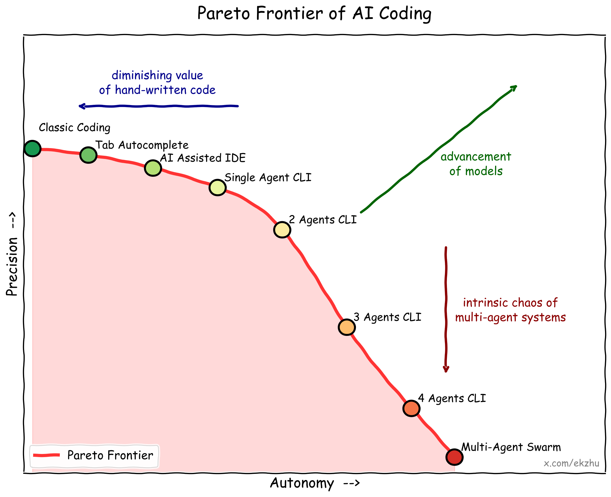

# Pareto Frontier of AI Coding

A fun XKCD-style diagram visualizing the tradeoff between **autonomy** and **precision** across the spectrum of AI coding tools — from classic hand-written code all the way to multi-agent swarms.

By [@ekzhu](https://x.com/ekzhu).
